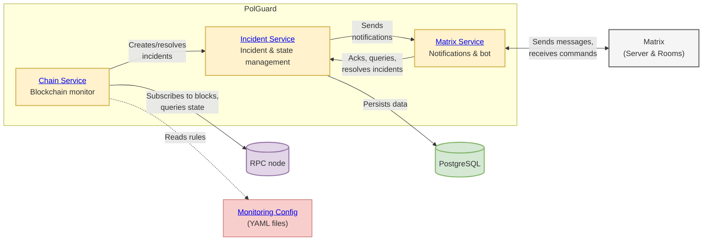

[](https://github.com/w3f/polguard/actions/workflows/ci.yml)

# PolGuard

PolGuard is a modular real-time monitoring platform for Polkadot, Kusama, and parachains. It tracks on-chain activity — balances, staking, governance, identity, assets, and XCM — surfacing what it detects as incidents, with monitoring rules defined in a single YAML config family shared across services.

## Quick Start

**Prerequisites:** Node.js 22+, Yarn 4.11+

```bash
git clone https://github.com/w3f/polguard.git
cd polguard
yarn install
yarn build
yarn start:chain
```

- Zero configuration needed
- Monitors Polkadot Asset Hub by default
- Starts from the latest finalized block
- Uses example [monitoring configs](packages/config/CONFIG_GUIDE.md) from `packages/config/examples/`

## Incidents

Everything PolGuard detects is an **incident**, with two independent properties:

- **Lifecycle** — *one-time* (a single occurrence, immediately resolved — e.g. a transfer) or *ongoing* (fires and later resolves — e.g. a balance dipping below a threshold)
- **Response** — *actionable* (a human acknowledges it via the bot, and it escalates to extra channels if they don't) or *informational* (surfaced for awareness)

Both are set per group in the [Config Guide](packages/config/CONFIG_GUIDE.md); each handler's lifecycle is listed in [Monitors & Handlers](packages/config/MONITORS.md).

## Deployment Modes

### Standalone Mode

Run the Chain service on its own — for trying it out, integrating via webhooks, or simple deployments.
See the [Chain service documentation](packages/chain/README.md) for architecture and configuration.

### Platform Mode

Run the full stack — incident management with database persistence and Matrix notifications.



```bash
# After cloning, installing, and building (Quick Start), start services in order:
yarn start:incident
yarn start:matrix
yarn start:chain
```

**Setup requirements:**
- PostgreSQL database for the Incident service
- Service config files for each service (examples in `packages/*/config/`)
- Matrix server credentials for the Matrix service

## Monitoring Configuration

Monitoring rules — what to watch and how to report it — are written in YAML, separately from each service's own runtime config (RPC endpoint, store, reporters, etc.). By default the Chain service loads the example rules in `packages/config/examples/`. To define your own:

- Write YAML rules following the [Config Guide](packages/config/CONFIG_GUIDE.md)
- Point `monitoringConfigsDir` in the Chain service config at your directory

See [Monitors & Handlers](packages/config/MONITORS.md) for everything that can be monitored. The same files also enroll accounts for the optional Payouts service — see [Operations: Payouts](packages/config/CONFIG_GUIDE.md#operations-payouts).

## Documentation

### Core Services
- [**Chain Service**](packages/chain/README.md) - Blockchain monitoring service
- [**Incident Service**](packages/incident/README.md) - REST API for incident & last block management
- [**Matrix Service**](packages/matrix/README.md) - Notifications & bot service
- [**Payouts Service**](packages/payouts/README.md) - Optional operations component: automated validator reward claims

### Supporting Packages
- [**Common Package**](packages/common/README.md) - Shared types, constants, utilities and telemetry
- [**Config Package**](packages/config/README.md) - YAML monitoring config & validation

### Configuration & Monitoring
- [**Config Guide**](packages/config/CONFIG_GUIDE.md) - Monitoring rules configuration
- [**Monitors & Handlers**](packages/config/MONITORS.md) - List of all supported monitors and handlers

### Development & Operations
- [**Deployment Guide**](deployment/README.md) - CI/CD, Helm, ArgoCD, Kubernetes deployment & NPM publishing
- [**E2E Tests**](e2e/README.md) - End-to-end testing setup and execution