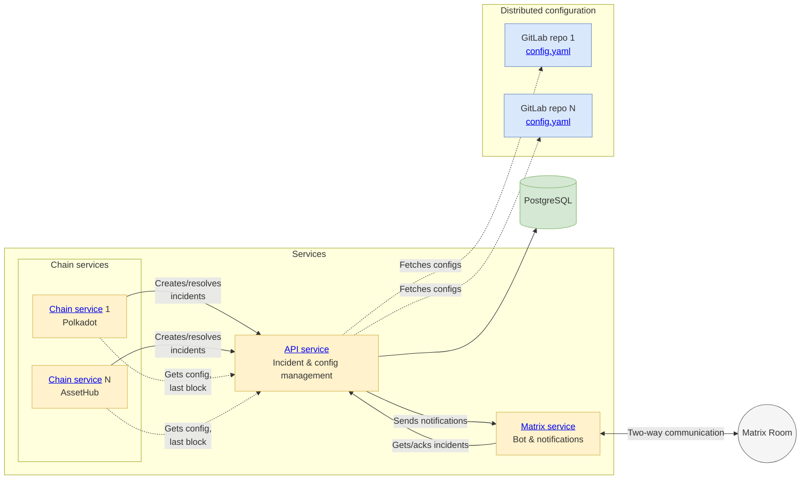

[](https://dl.circleci.com/status-badge/redirect/gh/w3f/monitoring-platform/tree/master)

# Monitoring Platform

The Monitoring Platform provides real-time monitoring of Polkadot, Kusama, and parachains, mostly for security-related events. It is built as a modular system of microservices, including Chain, API, and Matrix services, with distributed configuration across multiple sources and centralized incident management.

## Architecture



## Packages

| Package                                       | Role                           | Key features                                              |
|-----------------------------------------------|--------------------------------|-----------------------------------------------------------|
| [**API**](packages/api/README.md)             | Incident & config control      | Incident CRUD API, monitoring config, last block handling |
| [**Chain**](packages/chain/README.md)         | Blockchain monitor             | Balance changes, transfers, identity, voting and more     |
| [**Matrix**](packages/matrix/README.md)       | Notifications & bot            | Deliver/ack incidents via Matrix rooms, bot commands      |
| [**Common**](packages/common/README.md)       | Shared utilities               | Types, constants, utilities, telemetry configuration      |
| [**Config**](packages/config/README.md)       | YAML config & validation       | Load/validate monitoring rules                            |

## Installation & Setup

**Prerequisites:** Node.js 20+, Yarn 4.6+, PostgreSQL

```bash
git clone https://github.com/w3f/monitoring-platform.git
cd monitoring-platform
yarn install
yarn build
```

**Development:**
```bash
yarn start:api:dev
yarn start:chain:dev
yarn start:matrix:dev
```

## Configuration

- **Service config:** Per-package `config/config.yaml` files (connections, runtime params)
- **Monitoring rules:** YAML files defining chains, accounts, thresholds; see [Config Guide](packages/config/CONFIG_GUIDE.md)

## Deployment

- **CI/CD:** CircleCI builds Docker images & Helm charts
- **Helm charts:** Published to W3F Helm repo
- **ArgoCD:** Deploys apps `monitoring-stage`, `monitoring-prod`, `monitoring-oncall`
- **Kubernetes:** Each environment runs in its own namespace

See [Deployment Guide](deployment/README.md) for details.

## Testing

```bash
# Unit tests (per-package tests/ directory)
yarn test

# Integration tests (per-package tests/integration/ directory)  
yarn test:integration
```

**End-to-End tests:** Full flow (Chain → API → Matrix); see [E2E Tests](e2e/README.md)

## Documentation

### Core Services
- [**API Service**](packages/api/README.md) - REST API for incident & config management
- [**Chain Service**](packages/chain/README.md) - Blockchain monitoring service
- [**Matrix Service**](packages/matrix/README.md) - Notifications & bot service

### Supporting Packages
- [**Common Package**](packages/common/README.md) - Shared types, constants, utilities and telemetry
- [**Config Package**](packages/config/README.md) - YAML monitoring config & validation

### Configuration & Monitoring
- [**Config Guide**](packages/config/CONFIG_GUIDE.md) - Monitoring rules configuration
- [**Monitors & Handlers**](packages/config/MONITORS.md) - List of all supported monitors and handlers

### Development & Operations
- [**Deployment Guide**](deployment/README.md) - CI/CD, Helm, ArgoCD, Kubernetes deployment
- [**E2E Tests**](e2e/README.md) - End-to-end testing setup and execution
- [**Development Notes**](docs/NOTES.md) - Architecture, design decisions & known issues
- [**Publishing Guide**](docs/PUBLISHING.md) - NPM package release process
