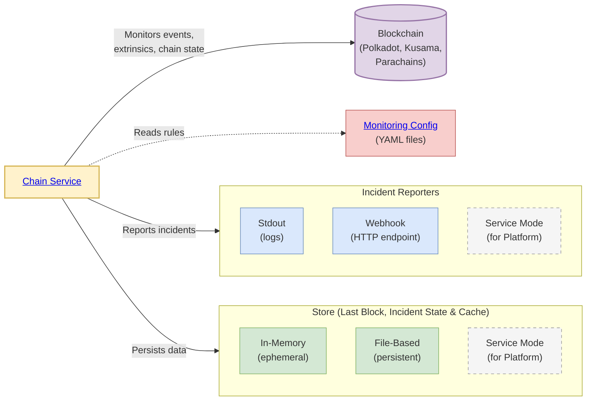
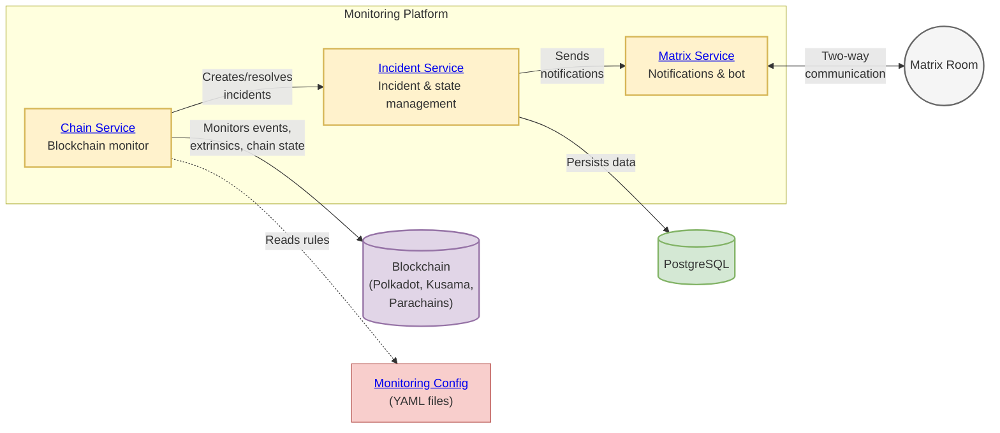

[](https://dl.circleci.com/status-badge/redirect/gh/w3f/monitoring-platform/tree/master)

# Monitoring Platform

The Monitoring Platform provides real-time monitoring of Polkadot, Kusama, and parachains, tracking blockchain activities such as balance changes, governance events, identity updates, and more. Built with a modular architecture, it can run as a lightweight standalone service or as a complete platform with incident management and notifications.

## Quick Start

```bash
yarn start:chain
```

- Zero configuration needed
- Monitors Polkadot Asset Hub by default
- Starts from the recent block
- Uses example [monitoring configs](packages/config/CONFIG_GUIDE.md) from `packages/config/examples/`

## Key Features

- **One-Time Incidents**: Generated from blockchain events and extrinsic calls when specific conditions are detected (e.g., transfer occurs)
- **Ongoing Incidents**: Continuously monitor conditions and can transition between firing and resolved states (e.g., balance drops below threshold and later recovers)
- **Acknowledgement**: Team members can acknowledge incidents via bot interface
- **Escalation**: Automatically escalate unacknowledged incidents to additional notification channels after a configurable timeout

## Deployment Modes

### Standalone Mode

_Perfect for trying out the platform, integrating with external systems via webhooks, or simple deployments_



The Chain service runs independently and can:
- Monitor any Polkadot SDK-based blockchain
- Report incidents to stdout or webhooks
- Store last block and cache data in-memory or as local files

**Great for:** Quick testing, webhook integrations, lightweight deployments

### Platform Mode

_Complete incident management with database persistence and notifications_



All three services working together:
- **Incident service**: Manages incident lifecycle and state in PostgreSQL
- **Matrix service**: Delivers notifications and provides bot interface
- **Chain service**: Monitors blockchains and reports incidents

**Great for:** Production use, team notifications, incident tracking

## Getting Started

### Prerequisites

Node.js 20+, Yarn 4.6+

### Monitoring Configuration

Both modes use the same approach for monitoring configuration. By default, the Chain service uses example configs from `packages/config/examples/`. To create your own monitoring rules:

1. Create YAML config files following the [Config Guide](packages/config/CONFIG_GUIDE.md)
2. Place them in a directory of your choice
3. Update the `monitoringConfigs.dir` setting in `packages/chain/config/config.yaml` to point to your directory

See [Monitors & Handlers](packages/config/MONITORS.md) for available monitoring capabilities.

### Standalone Mode

```bash
git clone https://github.com/w3f/monitoring-platform.git
cd monitoring-platform
yarn install
yarn build
yarn start:chain
```

For custom configuration options (RPC endpoints, storage, incident reporters), see the [Chain service documentation](packages/chain/README.md).

### Platform Mode

**Prerequisites:** Node.js 20+, Yarn 4.6+, PostgreSQL

```bash
git clone https://github.com/w3f/monitoring-platform.git
cd monitoring-platform
yarn install
yarn build

# Start services in order
yarn start:incident
yarn start:matrix
yarn start:chain
```

**Setup requirements:**
- PostgreSQL database for the Incident service
- Service configuration files for each service (see examples in `packages/*/config/`)
- Matrix server credentials for the Matrix service

For detailed configuration options, see individual service documentation below.

## Testing

```bash
# Unit tests
yarn test

# Integration tests
yarn test:integration
```

**End-to-End tests:** Full flow testing; see [E2E Tests](e2e/README.md)

## Documentation

### Core Services
- [**Incident Service**](packages/incident/README.md) - REST API for incident & last block management
- [**Chain Service**](packages/chain/README.md) - Blockchain monitoring service
- [**Matrix Service**](packages/matrix/README.md) - Notifications & bot service

### Supporting Packages
- [**Common Package**](packages/common/README.md) - Shared types, constants, utilities and telemetry
- [**Config Package**](packages/config/README.md) - YAML monitoring config & validation

### Configuration & Monitoring
- [**Config Guide**](packages/config/CONFIG_GUIDE.md) - Monitoring rules configuration
- [**Monitors & Handlers**](packages/config/MONITORS.md) - List of all supported monitors and handlers

### Development & Operations
- [**Deployment Guide**](deployment/README.md) - CI/CD, Helm, ArgoCD, Kubernetes deployment
- [**E2E Tests**](e2e/README.md) - End-to-end testing setup and execution
- [**Development Notes**](docs/NOTES.md) - Architecture, design decisions & known issues
- [**Publishing Guide**](docs/PUBLISHING.md) - NPM package release process
