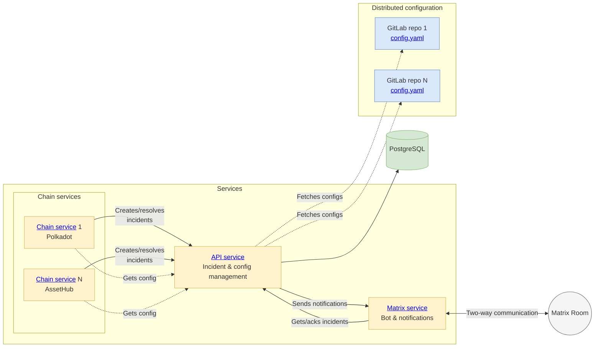

[](https://dl.circleci.com/status-badge/redirect/gh/w3f/monitoring-platform/tree/master)

# Monitoring Platform

A comprehensive monitoring solution for the Polkadot ecosystem, focusing on real-time detection and alerting.
Built with NestJS and Polkadot.js.

## Overview

The Monitoring Platform is designed to monitor Polkadot, Kusama, and related parachains, mostly for security-related events. The platform is built as a modular system with several specialized services working together, with the API service serving as the central control point for incident management and configuration.

## Architecture



## Packages

### Services

- [**API Service**](packages/api/README.md): Central control service that manages incidents, configurations, and notifications
  - Enables creating, tracking, acknowledging, and resolving incidents through a REST API
  - Provides centralized monitoring configuration for other services
  - Schedules notification retries and configuration refreshes
  - Handles automatic resolution of orphaned incidents

- [**Chain Service**](packages/chain/README.md): Monitors blockchain activities and generates incidents
  - Processes blockchain events, extrinsic calls and state changes
  - Creates incidents when issues are detected, resolves incidents
  - Some of the monitoring features:
    - Account balance tracking and balance transfer detection
    - Cross-chain assets transfers
    - Staking commission changes, slashes, and active set presence
    - Identity changes and verification
    - Referenda and voting activities

- [**Matrix Service**](packages/matrix/README.md): Handles sending notifications to Matrix rooms
  - Delivers incident notifications to Matrix rooms
  - Provides a bot interface for incident management
  - Supports incident acknowledgment via commands

- [**Telemetry Service**](packages/telemetry/README.md): Monitors node telemetry data (short-term solution to be removed in the future)
  - Processes telemetry data, tracks node hardware, software, location information
  - Creates incidents when issues are detected, resolves incidents

### Supporting Packages

- [**Types Package**](packages/types/README.md): Common types, interfaces, and constants used across all packages
  - Defines core data structures and enums
  - Provides type safety and consistency across packages

- [**Config Package**](packages/config/README.md): Monitoring configuration processing and validation
  - Enables defining monitoring groups with specific chains, accounts, and alert settings
  - Loads and validates YAML monitoring configuration files
  - Transforms raw configuration into structured monitoring groups
  - Provides utilities for address transformation and settings building
  - [Configuration Guide](packages/config/CONFIG_GUIDE.md): Detailed guide to the YAML configuration format
  - [Monitors & Handlers Reference](packages/config/MONITORS.md): Comprehensive list of all monitors and handlers

## Getting Started

### Prerequisites

- Node.js 20+
- Yarn 4.6.0+
- PostgreSQL
- Redis

### Installation

```bash
git clone https://github.com/w3f/monitoring-platform.git
cd monitoring-platform
yarn install
yarn build
```

### Configuration

There are two types of configuration in this project:

1. **Application Configuration**: Each service has its own application configuration file in its `config` directory. These files configure the service's behavior, connections, and runtime parameters.

2. **Monitoring Configuration**: Separate from application configuration, this defines what to monitor (accounts, chains, thresholds, etc.) and is processed by the Config package and served by the API service.

Example application configurations can be found in the `config` directory of each package.

### Running Services

Start individual services in development mode:

```bash
yarn start:api:dev
yarn start:chain:dev
yarn start:matrix:dev
```

For more details on configuring and running each service, refer to the README in each service's package directory.

### Deployment

The project includes deployment configurations in the `deployment` folder:

- Docker Compose setup for local development
- Helm chart for Kubernetes deployment

For more details on deployment options, see the [Deployment Guide](deployment/README.md).

## End-to-End Tests

The project includes end-to-end tests that verify the complete flow from chain events to API incidents to Matrix notifications. These tests can be run locally using KinD or as part of the CI/CD pipeline.

For more details, see the [E2E Tests Documentation](e2e/README.md).

## Development

For development guidelines and notes, see the [Development Notes](docs/DEVELOPMENT.md).
For information on publishing packages, see the [Publishing Guide](docs/PUBLISHING.md).
