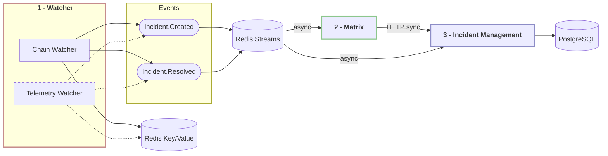

[](https://dl.circleci.com/status-badge/redirect/gh/w3f/monitoring-platform/tree/master)

# Monitoring Platform

## Overview

The platform consists of microservices and shared packages:

### Microservices (Private)
1. **@w3f/monitoring-watcher** - Monitoring service with:
   - Chain monitoring: observes blockchain activities and generates incidents
   - Telemetry monitoring: _(Coming Soon)_ observes node metrics
   [More details](./packages/watcher/README.md)
2. **@w3f/monitoring-matrix** - Notification service for sending alerts and updates to specified channels. [More details](./packages/matrix/README.md)
3. **@w3f/monitoring-incident-management** - _(Draft)_ API gateway service for managing and coordinating incidents across the platform. [More details](./packages/incident-management/README.md)

All services are built with Nest.js, supporting both synchronous and asynchronous communication using Redis Streams.

### Shared Packages (Public)
1. **@w3f/monitoring-types** - Common types and interfaces used across the platform
2. **@w3f/monitoring-config** - Configuration processing package, provides YAML configuration validation and transformation. [More details](./packages/config/README.md)

## Documentation

### User Documentation
- [Configuration Guide](./docs/CONFIG_GUIDE.md) - Detailed instructions for creating YAML configuration files
- [Monitors & Handlers Reference](./docs/MONITORS.md) - Comprehensive guide to available monitors and their handlers

### Technical Documentation
- [Watcher service](./packages/watcher/README.md)
- [Matrix service](./packages/matrix/README.md)
- [Config package](./packages/config/README.md)
- [Development Notes](./docs/DEVELOPMENT.md) - Project structure, architectural decisions, and roadmap
- [Publishing Guide](./docs/PUBLISHING.md) - Instructions for building and publishing packages

## Architecture Overview



The platform uses:
- Redis Streams for asynchronous event processing
- Redis Key/Value for caching and state management
- PostgreSQL for incident history and management
- Matrix for alert notifications

## Quick Start

There are two ways to run the monitoring platform:

### 1. Running Services Locally (with Node.js)

This approach is recommended for development and testing:

1. Create your monitoring configuration:
   - Create a YAML file following the [Configuration Guide](./docs/CONFIG_GUIDE.md)
   - Place it in `packages/watcher/monitoring-configs/`

2. Set up application config for Watcher:
   - Create configuration file for the service
   - Place it in `packages/watcher/config/`

3. Start Redis:
   ```bash
   cd deployment
   docker-compose up redis
   ```

4. Run Watcher service:
   ```bash
   yarn build:all # First time only
   yarn start:watcher:dev
   ```

5. Set up application config for Matrix:
   - Create configuration file for the service
   - Place it in `packages/matrix/config/`

6. Run Matrix service:
   ```bash
   export MATRIX_PASSWORD=your_password
   yarn start:matrix:dev
   ```

### 2. Using docker-compose

This approach runs all services with Redis streams and Matrix notifications:

1. Set up configurations in `deployment/app-config/`:
   - `watcher.yaml` - Watcher service configuration
   - `watcher.monitoring.yaml` - Monitoring configuration
   - `matrix.yaml` - Matrix service configuration

2. Set Matrix password:
   ```bash
   export MATRIX_PASSWORD=your_password
   ```

3. Start all services:
   ```bash
   cd deployment
   docker-compose up
   ```

## Development Workflow

When working with local changes:

```bash
# Build all packages
yarn build:all

# Or build specific package in case of changes
yarn build:types
yarn build:config
yarn build:watcher
yarn build:matrix

# Run services
yarn start:watcher:dev
yarn start:matrix:dev
```

## Links

- [Project Timeline](https://docs.google.com/spreadsheets/d/1twBMKTNauqBwBL2ZccdGFIPfVOj8efJolkUCv-wWvgQ)
- [Architecture Discussion](https://github.com/w3f/SecOps/issues/599)