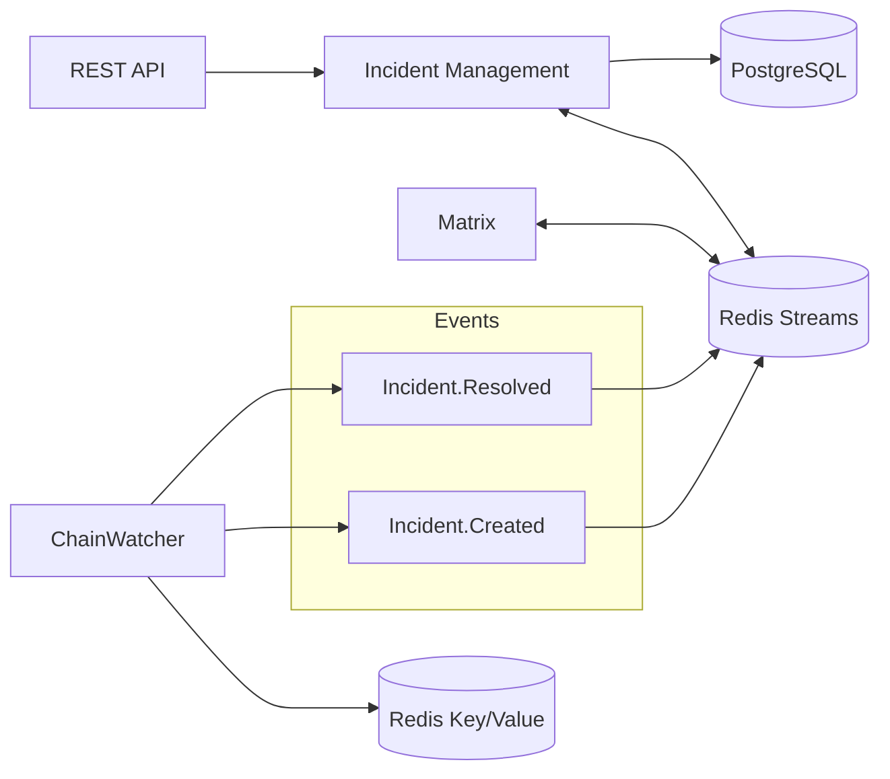

# Monitoring Platform

🚧 **This project is in active development and is currently a draft.** 🚧  
Regular Git flow with PRs will start once the first version is ready.

## Overview

The Monitoring Platform consists of three microservices:

1. **ChainWatcher** - Monitoring service responsible for observing blockchain activities and generating incidents. [More details](./chain-watcher/README.md)
2. **Matrix** - Notification service for sending alerts and updates to specified channels. [More details](./matrix/README.md)
3. **Incident Management** - API gateway service for managing and coordinating incidents across the platform.

All services are built with Nest.js, supporting both synchronous and asynchronous communication using Redis Streams.

## Architecture Overview

## Links

- [Project Timeline](https://docs.google.com/spreadsheets/d/1twBMKTNauqBwBL2ZccdGFIPfVOj8efJolkUCv-wWvgQ)
- [Architecture Discussion](https://github.com/w3f/SecOps/issues/599)