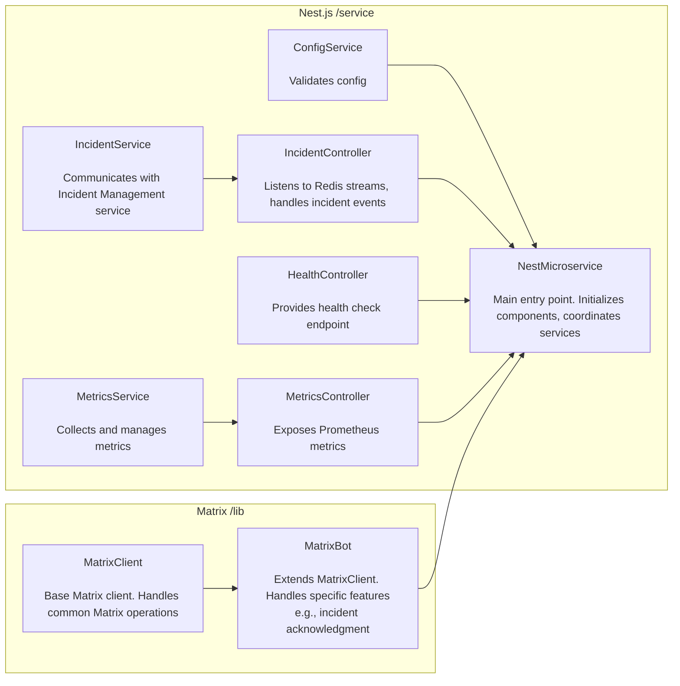

# Matrix Service

## Architecture Overview

The following diagram illustrates the high-level architecture and connections between different components of the Matrix service:

```mermaid
flowchart LR
    subgraph NestClasses["Nest.js /service"]
        A[NestMicroservice<br><br>Main entry point. Initializes components, coordinates services]
        B[ConfigService<br><br>Validates config]
        C[IncidentController<br><br>Listens to Redis streams, handles incident events]
        D[IncidentService<br><br>Communicates with Incident Management service]
        E[HealthController<br><br>Provides health check endpoint]
        F[MetricsController<br><br>Exposes Prometheus metrics]
        G[MetricsService<br><br>Collects and manages metrics]
    end

    subgraph MatrixClasses["Matrix /lib"]
        H[MatrixClient<br><br>Base Matrix client. Handles common Matrix operations]
        I[MatrixBot<br><br>Extends MatrixClient. Handles specific features<br>e.g., incident acknowledgment]
    end

    B --> A
    C --> A
    D --> C
    E --> A
    F --> A
    G --> F
    H --> I
    I --> A
```