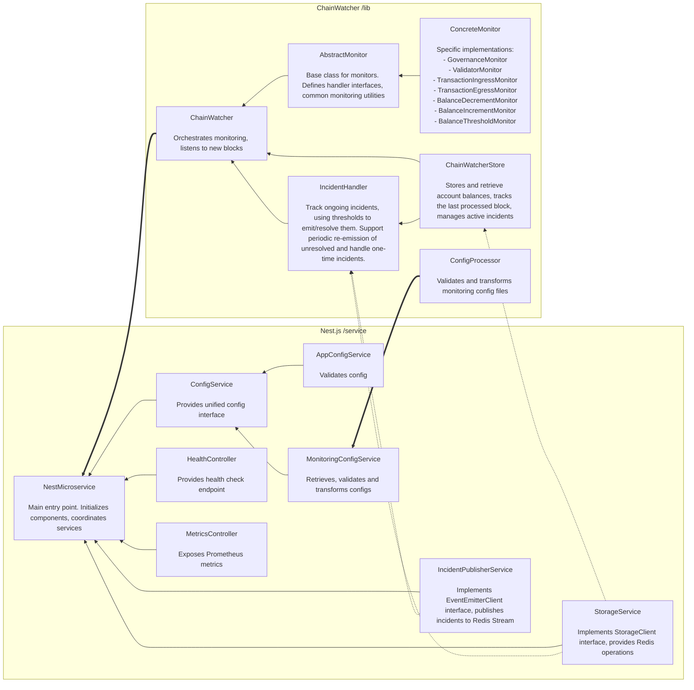

# Chain Watcher

## Architecture Overview

The following diagram illustrates the high-level architecture and connections between different components of the system:

### Connection Types
- Solid line (`-->`) : Direct dependency/method calls
- Dotted line (`-.->`) : Data access/persistence
- Double line (`==>`) : Configuration/initialization flow

### Data Flow
1. ConfigProcessor validates configs which are served via MonitoringConfigService
2. ChainWatcher initializes monitors based on configuration
3. Monitors process new blocks and report to IncidentHandler
4. IncidentHandler uses StorageService for persistence and publishes through IncidentPublisherService
5. MetricsController exposes:
   - Standard Prometheus metrics (memory, CPU, etc.)
   - Custom metrics (latest block height, monitoring status)
6. HealthController provides liveness/readiness probes for Kubernetes health checks
