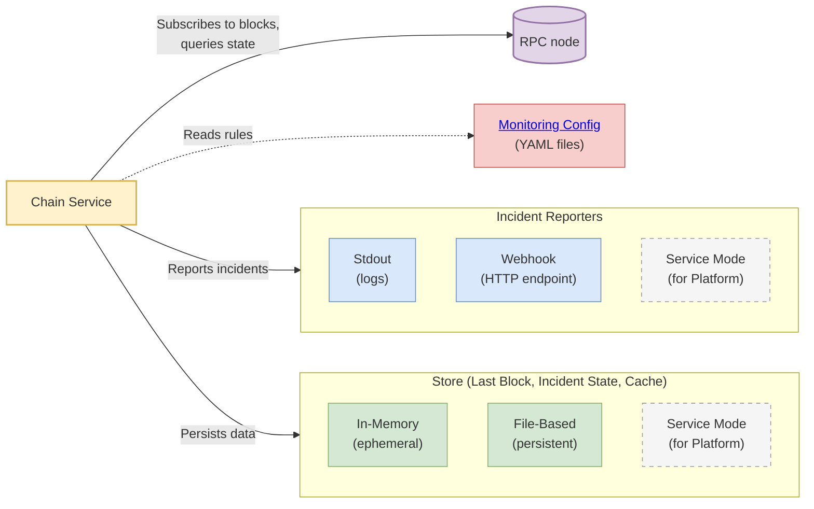
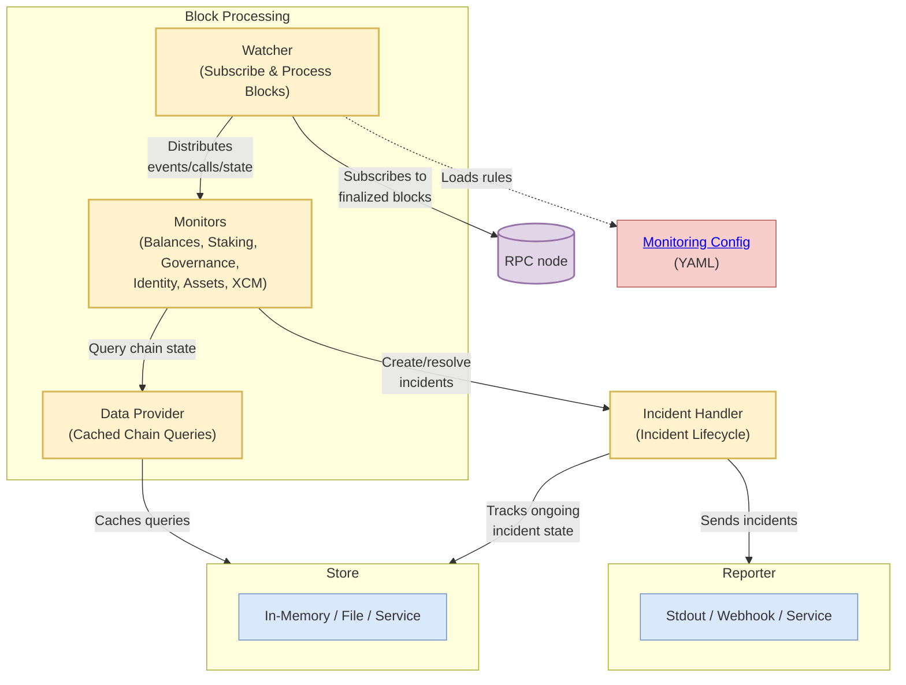

# @w3f/polguard-chain

The Chain service is PolGuard's monitoring engine. It watches Polkadot-ecosystem chains block by block and turns on-chain activity — balances, staking, governance, identity, assets, and XCM — into incidents, running standalone or as part of the platform.

## Key Features

- **Multi-chain**: any Polkadot SDK-based chain, via [PAPI](https://papi.how/)
- **Broad coverage**: balances, staking, governance, identity, assets, and XCM
- **One-time & ongoing incidents**: discrete events and calls, plus continuously tracked state that auto-resolves
- **Pluggable store & reporter**: store: in-memory, file, or service; reporter: stdout, webhook, or service

See the [Monitors & Handlers Reference](../config/MONITORS.md) for the full list of what can be monitored.

## Deployment

Standalone, the Chain service connects to an RPC node, loads monitoring rules from YAML, and reports incidents to stdout or a webhook:



In platform mode, the store and reporter switch to *service* mode (dashed above), talking to the [Incident service](../incident/README.md) instead of local storage/stdout. See the [main README](../../README.md#deployment-modes) for the full platform architecture.

## Architecture



- **Watcher**: subscribes to finalized blocks and distributes events, calls, and state to monitors
- **Monitors**: analyze that data and decide when to create or resolve incidents
- **Data Provider**: cached access to chain state queries
- **Incident Handler**: manages incident lifecycle and tracks ongoing incident state

Operationally:

- **Sequential processing**: blocks are processed in order; the last processed block is persisted every 5 minutes and on shutdown, so a restart resumes where it left off (`startBlock` in the app config is a one-time override).
- **Config reload**: the monitoring config is fingerprinted on every loop iteration — editing the YAML rebuilds the monitors, no restart needed.
- **RPC failover**: `rpcUrl` accepts a list; the connection rotates to the next endpoint on socket failure or a stale heartbeat.

The code splits into two layers: **`src/lib/`** holds this framework-agnostic logic (all chain access via PAPI), and **`src/service/`** is the Fastify runtime that wires it up — config loading, chain connection, health and metrics endpoints, and the concrete Store and Reporter implementations.

## Configuration

Two configs:

- **App config** (`config/config.yaml`): chain RPC/name, store, incident reporter, etc. See
  [config.yaml.example](./config/config.yaml.example) — comments there cover defaults, required
  vs. optional fields, allowed values, and env-var overrides.
- **Monitoring config** (`monitoringConfigsDir`): the shared YAML rules directory. See the
  [Config Guide](../config/CONFIG_GUIDE.md).

## API Endpoints

- `GET /health` — health check

## Telemetry

Exposes Prometheus metrics at `localhost:9464/metrics`. Each metric is prefixed `polguard_chain_` and labelled by `chain`:

- `polguard_chain_latest_block_on_chain` — the latest block, from the RPC subscription
- `polguard_chain_last_block_processed` — the last block fully processed
- `polguard_chain_current_block_processing` — the block currently being processed
- `polguard_chain_block_processing_time` — per-block processing time (ms)
- `polguard_chain_total_groups` — monitoring groups loaded
- `polguard_chain_total_accounts` — accounts monitored
- `polguard_chain_total_monitors` — active monitor types

## Development

```bash
yarn build             # compile to dist/
yarn start:dev         # run dist/ with restart-on-change (pair with `yarn build --watch`)
yarn test              # unit tests
yarn test:integration  # integration tests
```

Blockchain access uses [PAPI](https://papi.how/); chain descriptors live in `.papi/` and are built on `postinstall`. To add a chain:

```bash
npx papi add assetHubPolkadot -n polkadot_asset_hub  # add a descriptor
npx papi                                             # regenerate after metadata changes
```

New descriptors also need an entry in `src/service/papi-descriptors.ts` and a `Chain` enum value in `@w3f/polguard-common`.
