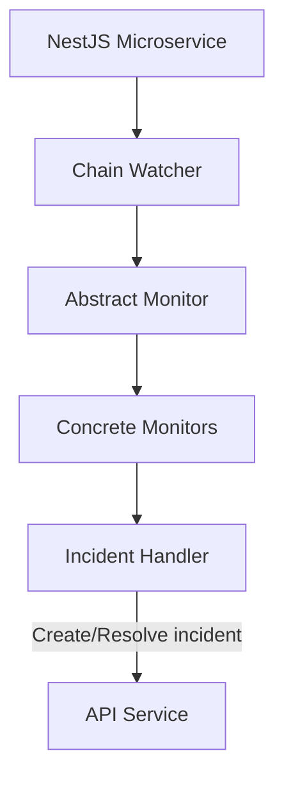

# @w3f/monitoring-chain

Blockchain monitoring service for the Monitoring Platform.

## Overview

The Chain service is responsible for monitoring blockchain activities and generating or resolving incidents based on detected conditions. It processes blockchain events, extrinsic calls, and state changes to track various on-chain activities across the Polkadot ecosystem.

## Simplified Architecture Overview



## Monitors

The Chain service includes several specialized monitors:

- **Staking Monitor**: Tracks validator activities, commission rates, and staking parameters
- **Balances Monitor**: Monitors account balances and transfers
- **Identity Monitor**: Tracks on-chain identity information
- **Governance Monitor**: Monitors governance activities like referenda and voting
- **XCM Monitor**: Tracks cross-chain asset transfers

For a complete reference of all monitors and handlers, see the [Monitors & Handlers Reference](../config/MONITORS.md).

## Configuration

The Chain service requires a configuration file to specify its behavior. For an example configuration, see the [example config file](./config/config.yaml.example).

## Usage

### Prerequisites

- Node.js 20+
- Yarn 4.6.0+
- Redis
- Access to a blockchain RPC node
- API service (for monitoring configuration and incident management)

### Installation

```bash
# Install dependencies
yarn install

# Build the package
yarn build
```

### Running the Service

```bash
# Start in development mode
yarn start:dev

# Start in production mode
yarn start
```

## Development

### Project Structure

- `src/lib/`: Core monitoring logic
  - `monitors/`: Specialized monitors for different blockchain aspects
  - `watcher.ts`: Main block processing and monitor coordination
  - `incident-handler.ts`: Incident creation and resolution
  - `data-provider.ts`: Blockchain data access
  - `account-registry.ts`: Account lookup and filtering
  - `formatter.ts`: Message formatting utilities
  - `decorators.ts`: Decorators for handler registration
- `src/service/`: Service implementation
  - `config/`: Configuration handling
  - `health/`: Health check endpoints
  - `incident/`: Incident publishing
  - `metrics/`: Prometheus metrics
  - `watcher/`: Watcher service implementation

### Testing

```bash
# Run tests
yarn test

# Run tests in watch mode
yarn test:watch

# Run tests with coverage
yarn test:coverage
