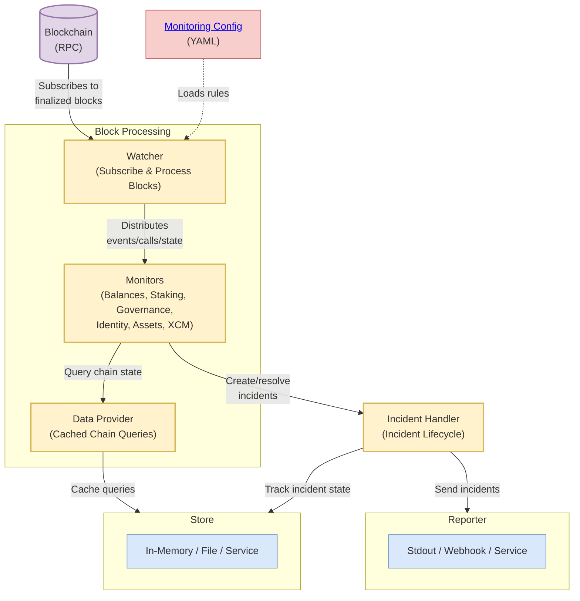

# @w3f/monitoring-chain

The Chain service monitors blockchain activities and generates or resolves incidents based on detected conditions. It processes blockchain events, extrinsic calls, and state changes across Polkadot ecosystem chains.

## Key Features

- **One-Time & Ongoing Incidents**: Supports both event-based incidents and continuous state monitoring with automatic resolution
- **Multi-Chain Support**: Monitor any Polkadot SDK-based blockchain
- **Flexible Architecture**: Configurable store (in-memory, file, service) and incident reporters (stdout, webhook, service)
- **Comprehensive Monitoring**: Tracks balances, staking, governance, identity, assets, and XCM transfers

See [Monitors & Handlers Reference](../config/MONITORS.md) for complete list of monitoring capabilities.

## Architecture



**Key Components:**
- **Watcher**: Subscribes to blocks, processes them sequentially, and distributes events/calls/state to monitors
- **Monitors**: Analyze blockchain data and decide when to create or resolve incidents
- **Data Provider**: Provides cached access to chain state queries
- **Incident Handler**: Manages incident lifecycle (creation/resolution) and tracks ongoing incident state
- **Store**: Persists last block, incident state, and caches chain queries
- **Reporter**: Outputs incidents to configured destination

## API Endpoints

- `GET /health` - Health check

## Configuration

The service is configured via `config/config.yaml`. Key configuration areas:

- **Chain**: RPC URL, starting block, chain name (e.g., AssetHubPolkadot)
- **Store**: Type (inMemory/file/service) and connection details
- **Incident Reporter**: Type (stdout/webhook/service) and connection details
- **Monitoring Configs**: Directory path for YAML monitoring rules

See [config.yaml.example](./config/config.yaml.example) for complete configuration options.

## Telemetry

Exposes Prometheus metrics on `localhost:9464/metrics`:

- `latest-block-on-chain`
- `last-block-processed`
- `current-block-processing`
- `block-processing-time`
- `total-groups`
- `total-accounts`
- `total-monitors`

## Development

```bash
# Run in development mode
yarn start:dev

# Run tests
yarn test
yarn test:integration
```