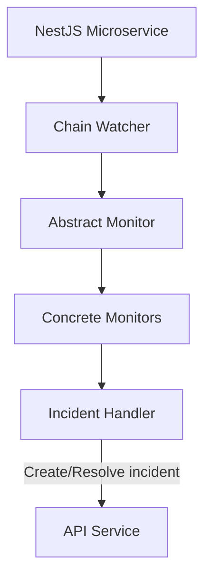

# @w3f/monitoring-chain

The Chain service is responsible for monitoring blockchain activities and generating or resolving incidents based on detected conditions. It processes blockchain events, extrinsic calls, and state changes to track various on-chain activities across the Polkadot ecosystem.

## Key Features

- **Block Processing**: Processes blockchain blocks sequentially to ensure ordered analysis
- **Event Monitoring**: Tracks and analyzes blockchain events for anomalies and conditions
- **Extrinsic Monitoring**: Processes extrinsics including nested calls
- **State Monitoring**: Tracks on-chain state changes
- **Multi-Monitor Architecture**: Supports specialized monitors for different blockchain aspects
- **Configuration Refresh**: Periodically updates monitoring configuration
- **Block Progress Tracking**: Updates last processed block information in the API service
- **Incident Generation**: Creates and resolves incidents by sending calls to the API service. Supports two types of incidents:
  - **One-time incidents**: Generated from events and calls when specific conditions are detected
  - **Firing/Resolved incidents**: Generated from state handlers that continuously monitor conditions and can transition between firing and resolved states

### Monitors

The Chain service includes several specialized monitors:

- **Staking Monitor**: Tracks validator activities, commission rates, and staking parameters
- **Balances Monitor**: Monitors account balances and transfers
- **Assets Monitor**: Monitors asset/token balances and transfers
- **Identity Monitor**: Tracks on-chain identity information
- **Governance Monitor**: Monitors governance activities like referenda and voting
- **XCM Monitor**: Tracks cross-chain asset transfers

For a complete reference of all monitors and handlers, see the [Monitors & Handlers Reference](../config/MONITORS.md).

## Simplified Architecture Overview



## REST API Endpoints

### Health and Metrics

- `GET /health`: Health check endpoint that returns a 200 status code when the service is healthy
- `GET /metrics`: Prometheus metrics endpoint that exposes default Node.js metrics and custom metrics (block height, accounts count, monitors count, groups count)

## Configuration

The Chain service requires a configuration file to specify its behavior. For an example configuration, see the [example config file](./config/config.yaml.example).

## Usage

### Prerequisites

- Node.js 20+
- Yarn 4.6.0+
- Access to a blockchain RPC node
- API service (for monitoring configuration and incident management)

### Running the Service

```bash
yarn install
yarn build
yarn start
```

## Development

```bash
yarn start:dev
yarn test
yarn test:integration
```

### Project Structure

- `src/lib/`: Core monitoring logic
  - `monitors/`: Specialized monitors for different blockchain aspects
  - `watcher.ts`: Main block processing and monitor coordination
  - `incident-handler.ts`: Incident creation and resolution
  - `data-provider.ts`: Blockchain data access
  - `account-registry.ts`: Account lookup and filtering
  - `formatter.ts`: Message formatting utilities
  - `decorators.ts`: Decorators for handler registration
- `src/service/`: Service implementation
  - `config/`: Configuration handling
  - `health/`: Health check endpoints
  - `incident/`: Incident publishing
  - `metrics/`: Prometheus metrics
  - `watcher/`: Watcher service implementation
