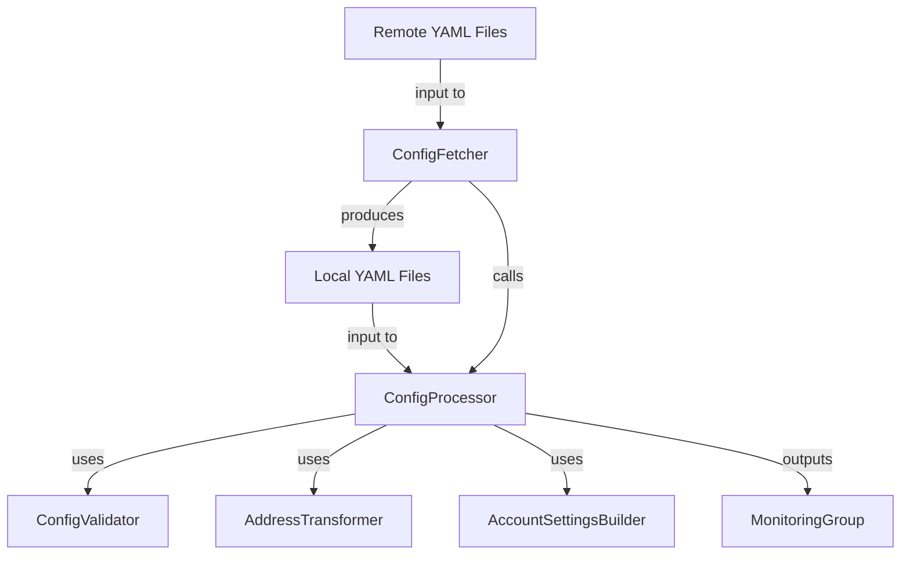

# @w3f/monitoring-config

Configuration processing and validation for the Monitoring Platform.

## Overview

The Config package is responsible for loading, validating, and processing monitoring configuration files. It transforms raw YAML configurations into structured monitoring groups that can be used by the monitoring services.

## Documentation

- [Configuration Guide](CONFIG_GUIDE.md) - Detailed guide to the YAML configuration format
- [Monitors & Handlers Reference](MONITORS.md) - Comprehensive list of all monitors and handlers

## Components

### Component Relationships



#### ConfigFetcher

Main entry point for fetching remote configurations:
- Fetches YAML files from URLs (e.g., GitLab, GitHub)
- Saves them locally for processing
- Supports authentication tokens for private repositories
- **Calls ConfigProcessor** to process the fetched files

#### ConfigProcessor

Main entry point for processing local configuration files:
- Loads and validates YAML configuration files
- Applies default settings when not explicitly provided
- Creates separate group for each chain configuration
- Transforms addresses to chain-specific SS58 format
- Merges monitor-level settings and account-level settings
- Converts decimal balance strings to chain-specific BigInt values

#### ConfigValidator

Performs validation of raw configuration data:
- Ensures proper structure and required fields
- Validates field formats and values
- Checks cross-field dependencies

#### AccountSettingsBuilder

Builds account monitor settings by:
- Combining monitor and account-level configurations
- Applying defaults for missing settings
- Converting decimal balances to BigInt values

#### AddressTransformer

Handles blockchain address transformations:
- Converts between hex and SS58 formats
- Ensures correct chain-specific encoding


## Installation

```bash
yarn add @w3f/monitoring-config
```

## Usage Examples

The package exports two main classes:

### ConfigFetcher

Used to fetch remote configuration files and process them:

```typescript
import { ConfigFetcher } from '@w3f/monitoring-config';

// Fetch from remote sources and process
const sources = [
  { name: 'main', url: 'https://gitlab.com/config.yaml', authToken: 'token' }
];
const monitoringGroups = await ConfigFetcher.fetchAndProcessConfigs(sources, './monitoring-configs');
```

### ConfigProcessor

Used directly with local YAML files:

```typescript
import { ConfigProcessor } from '@w3f/monitoring-config';
import * as fs from 'fs';

// Process existing YAML files in the filesystem
const configFiles = ['./monitoring-configs/config1.yaml',];
const monitoringGroups = ConfigProcessor.processConfigs(configFiles);
```
