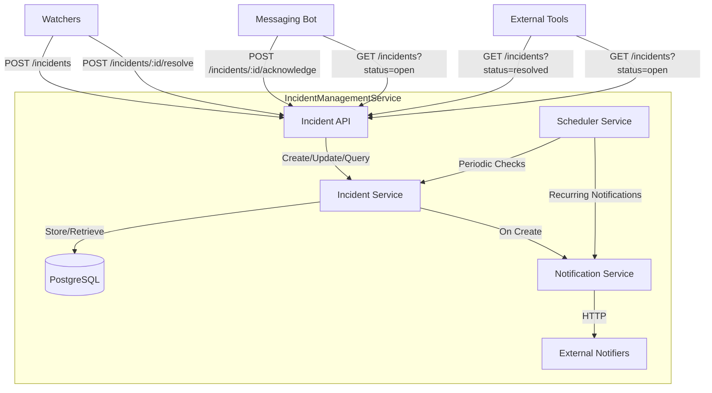

# Incident Management Service

A private API service for managing monitoring incidents.

## Description

The Incident Management Service provides a centralized system for tracking and managing incidents detected by monitoring services. It offers a REST API for creating, acknowledging, resolving, and querying incidents.

## Features

- Create incidents from monitoring watchers
- Acknowledge incidents from notification bots
- Resolve incidents manually or automatically
- Query incidents with filtering options
- Send notifications for new and recurring incidents
- Auto-resolve old incidents

## Architecture



## API Endpoints

### GET /incidents
Returns a list of incidents with optional filtering.

Query parameters:
- `status`: Filter by incident status (`open`, `acked`, `resolved`, `all`)
- `createdAfter`: Filter incidents created after a specific date
- `createdBefore`: Filter incidents created before a specific date
- `chain`: Filter by blockchain chain
- `wallet`: Filter by wallet address
- `groupId`: Filter by group id
- `handlerName`: Filter by handler name

### POST /incidents
Creates a new incident.

### POST /incidents/:id/acknowledge
Acknowledges an incident by ID.

### POST /incidents/:id/resolve
Resolves an incident by ID.

## Configuration

The service requires a configuration file at `config/config.yaml` with the following structure:

```yaml
environment: development

database:
  host: localhost
  port: 5432
  username: postgres
  password: postgres
  database: incident_management

logging:
  level: debug
```
