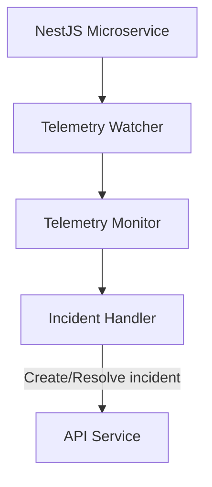

# @w3f/monitoring-telemetry

The Telemetry service is responsible for monitoring node telemetry data and generating or resolving incidents based on detected conditions. It processes information about node hardware, software, location, and other telemetry metrics to ensure nodes meet expected requirements.

Note: This service is a temporary solution and will be removed in the future.

## Key Features

- **Telemetry Processing**: Processes node telemetry data to analyze node status
- **Multi-Monitor Architecture**: Supports specialized monitors for different telemetry aspects
- **Configuration Refresh**: Periodically updates monitoring configuration
- **Incident Generation**: Creates and resolves incidents based on detected conditions

### Monitors

The Telemetry service includes one specialized monitor:

- **Telemetry Monitor**: Tracks node hardware, software, location, and network information

For a complete reference of all monitors and handlers, see the [Monitors & Handlers Reference](../config/MONITORS.md).

## Simplified Architecture Overview



## REST API Endpoints

### Health and Metrics

- `GET /health`: Health check endpoint that returns a 200 status code when the service is healthy
- `GET /metrics`: Prometheus metrics endpoint that exposes default Node.js metrics and custom metrics (accounts count, monitors count, groups count)

## Configuration

The Telemetry service requires a configuration file to specify its behavior. For an example configuration, see the [example config file](./config/config.yaml.example).

## Usage

### Prerequisites

- Node.js 20+
- Yarn 4.6.0+
- Redis
- Access to telemetry data source
- API service (for monitoring configuration and incident management)

### Running the Service

```bash
# Install dependencies
yarn install

# Build the package
yarn build

# Start in production mode
yarn start
```

## Development

```bash
# Start in development mode
yarn start:dev

# Run tests
yarn test
```

### Project Structure

- `src/lib/`: Core monitoring logic
  - `monitors/`: Telemetry monitor implementation
  - `watcher.ts`: Main telemetry processing and monitor coordination
  - `incident-handler.ts`: Incident creation and resolution
  - `decorators.ts`: Decorators for handler registration
- `src/service/`: Service implementation
  - `config/`: Configuration handling
  - `health/`: Health check endpoints
  - `incident/`: Incident publishing
  - `metrics/`: Prometheus metrics
  - `telemetry/`: Telemetry data fetching
  - `watcher/`: Watcher service implementation
