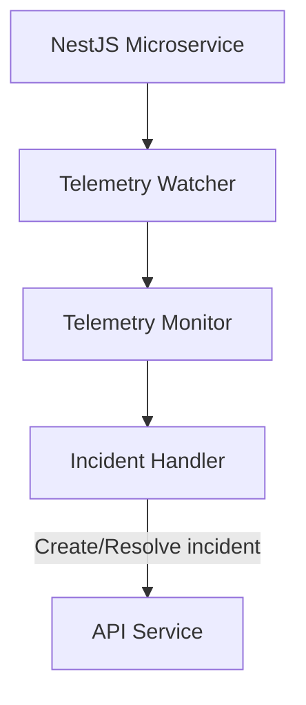

# @w3f/monitoring-telemetry

Telemetry monitoring service for the Monitoring Platform.

## Overview

The Telemetry service is responsible for monitoring node telemetry data and generating or resolving incidents based on detected conditions. It processes information about node hardware, software, location, and other telemetry metrics to ensure nodes meet expected requirements.

Note: This service is a temporary solution and will be removed in the future.

## Simplified Architecture Overview



## Monitors

The Telemetry service includes one specialized monitor:

- **Telemetry Monitor**: Tracks node hardware, software, location, and network information

For a complete reference of all monitors and handlers, see the [Monitors & Handlers Reference](../config/MONITORS.md).

## Configuration

The Telemetry service requires a configuration file to specify its behavior. For an example configuration, see the [example config file](./config/config.yaml.example).

## Usage

### Prerequisites

- Node.js 20+
- Yarn 4.6.0+
- Redis
- Access to telemetry data source
- API service (for monitoring configuration and incident management)

### Installation

```bash
# Install dependencies
yarn install

# Build the package
yarn build
```

### Running the Service

```bash
# Start in development mode
yarn start:dev

# Start in production mode
yarn start
```

## Development

### Project Structure

- `src/lib/`: Core monitoring logic
  - `monitors/`: Telemetry monitor implementation
  - `watcher.ts`: Main telemetry processing and monitor coordination
  - `incident-handler.ts`: Incident creation and resolution
  - `decorators.ts`: Decorators for handler registration
- `src/service/`: Service implementation
  - `config/`: Configuration handling
  - `health/`: Health check endpoints
  - `incident/`: Incident publishing
  - `metrics/`: Prometheus metrics
  - `telemetry/`: Telemetry data fetching
  - `watcher/`: Watcher service implementation

### Testing

```bash
# Run tests
yarn test

# Run tests in watch mode
yarn test:watch

# Run tests with coverage
yarn test:coverage
```