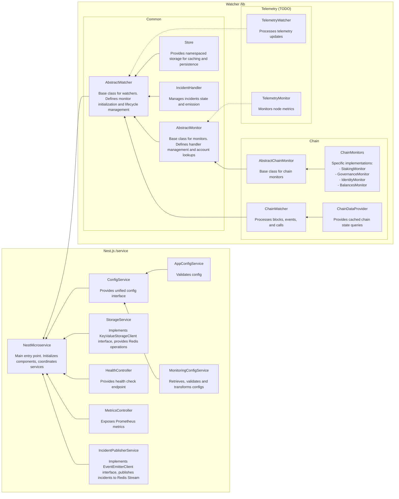

# Watcher

## Architecture Overview

The following diagram illustrates the high-level architecture and connections between different components of the system:

### Connection Types
- Solid line (`-->`) : Direct dependency/method calls
- Dotted line (`-.->`) : Planned/future components

### Components Overview

#### Common Infrastructure
- **AbstractWatcher**: Generic base for all watchers, handles monitor initialization and lifecycle
- **AbstractMonitor**: Generic base for all monitors, provides handler management and account lookups
- **Store**: Key-value storage for caching and persistence
- **IncidentHandler**: Manages and emits monitoring incidents

#### Chain Monitoring
- **ChainWatcher**: Processes blockchain data (blocks, events, calls)
- **AbstractChainMonitor**: Base for chain-specific monitors
- **Chain Monitors**: Specific implementations for different monitoring needs
- **ChainDataProvider**: Cached access to chain state

#### Telemetry Monitoring (Planned)
- **TelemetryWatcher**: Will process node telemetry data
- **TelemetryMonitor**: Will monitor node metrics

### Data Flow
1. Watcher initializes with appropriate configuration and dependencies
2. Monitors are created based on configuration
3. Chain/Telemetry data is processed through respective watchers
4. Incidents are managed and emitted through IncidentHandler
5. Data is cached/persisted through Store
6. Metrics and health status are exposed via controllers
